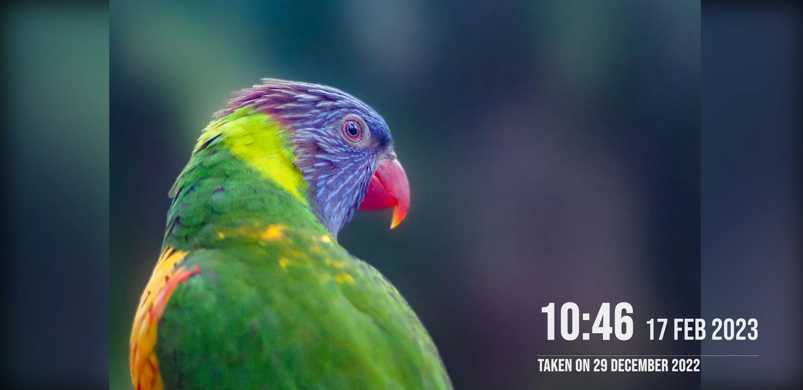

dav-slideshow
=============

This is a self contained webapp to show an instant slideshow of photos on a WebDAV share. Currently, this has been tested
against Nextcloud though support for other providers can be added.

## Features



Photo by [Bright Ice](https://www.flickr.com/people/159934952@N05/)

 - Basic support for images in a Nextcloud album.
 - Webapp doesn't require the user to authenticate (ideal for dashboards like Home Assistant).
 - Automatically rechecks album periodically.
 - Parses the capture date straight from the image and presents it.
 - Automatically transcodes to WebP if you have the optional `sharp` package installed (and your browser supports it).

## Getting started

You must edit the sample configuration in `.env.example` and rename it to `.env`.

Then to run the app, simply install the dependencies and build the application.

**Note:** This project uses Yarn v3 for package management. You may need to run `corepack enable`
to get the right version of Yarn.

```sh
yarn
yarn build
yarn start
``` 